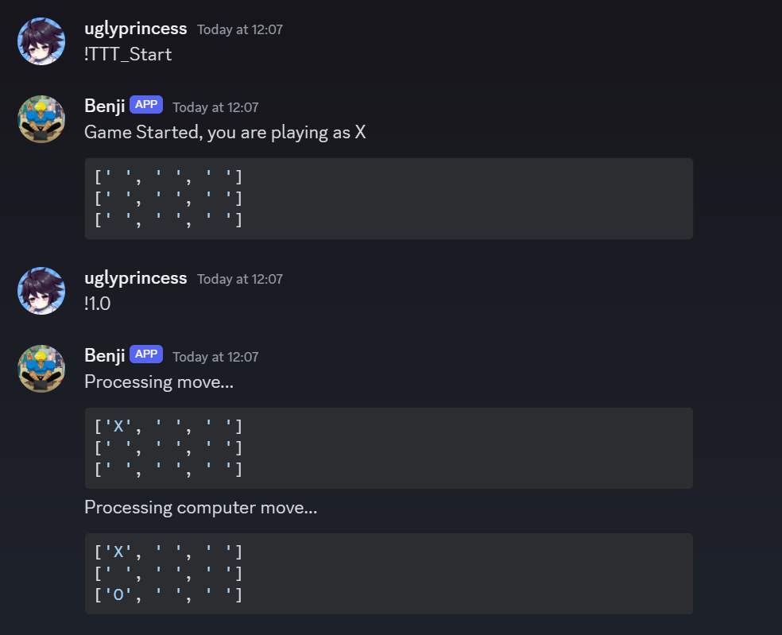

# Benji Discord Bot

This is just a silly little discord bot

## Table of Contents

- [Usage](#usage)
- [Contributing](#contributing)
- [Endresult](#end-result)

## Usage

To use the Benji Discord Bot, follow these steps:

1. Invite the bot to your Discord server by clicking on the following link: [Invite Benji Bot](https://discord.com/oauth2/authorize?client_id=1233320753391206440&permissions=8&scope=bot)

2. Once the bot is added to your server, you can interact with it using the following commands:

   - `!hi`: Greet the bot
   - `!help`: Display the list of available commands
   - `!suck`: Receive a playful response
   - `!<number1>+<number2>`: Add two numbers
   - `!<number1>-<number2>`: Subtract two numbers
   - `!<number1>*<number2>`: Multiply two numbers
   - `!<number1>/<number2>`: Divide two numbers
   - `!insult`: Receive a random insult
   - `!say <message>`: Make the bot say a message

3. Additionally, you can play Tic Tac Toe with the bot using the following commands:

   - `!TTT_Start`: Starts a new game
   - `!x.y`: Places an X on the board, where `x` is the row and `y` is the index

## Contributing

We welcome contributions from the community to help improve Chatify further. Whether it's fixing bugs, adding new features, or enhancing the UI, your contributions are highly appreciated.

## Endresult

